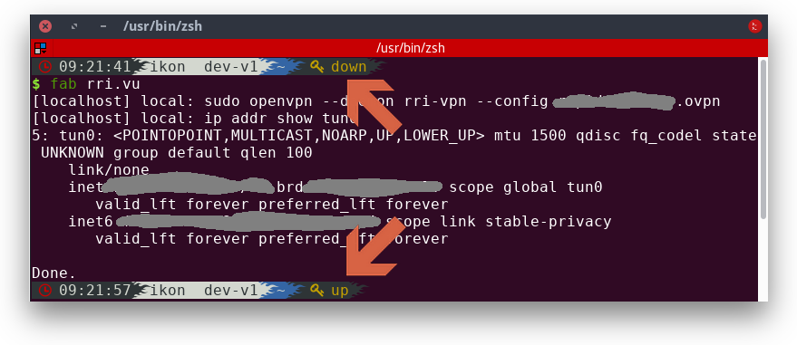

# How to create a new car in virtually any language

This document will describe the process to add new car plugin in
virtually any language.

Let me drive you through the feature with a simple example.

Name of the plugin: `demo`

## Env variable naming

prefix: `BULLETTRAIN_CAR_PLUGIN_`

suffixes:

| Suffix                | Description                                                                           | Default value      | Mandatory |
|:----------------------|:--------------------------------------------------------------------------------------|:-------------------|:----------|
| `_CMD`                | Command with it's arguments to be executed to generate text onto STDOUT.              | Creator defined.   | yes       |
| `_SHOW`               | Used by the creator to determine if the plugin should be shown in the current render. | true               | no        |
| `_PAINT`              | Colours of the car.                                                                   | Creator defined.   | yes       |
| `_TEMPLATE`           | Template of the car.                                                                  | Creator defined.   | yes       |
| `_SYMBOL_ICON`        | Symbol to be displayed on the left hand side of the car.                              | Creator defined.   | yes       |
| `_SYMBOL_PAINT`       | Colours of the symbol.                                                                | Creator defined.   | yes       |
| `_SEPARATOR_SYMBOL`   | Override the right hand side separator's symbol.                                      | Algorythm defined. | no        |
| `_SEPARATOR_TEMPLATE` | Override the right hand side separator's template.                                    | Algorythm defined. | no        |
| `_SEPARATOR_PAINT`    | Override the right hand side separator's colours.                                     | Algorythm defined. | no        |

Example:

`BULLETTRAIN_CAR_PLUGIN_DEMO_SHOW`

## _CMD variable explained

In our example, the `BULLETTRAIN_CAR_PLUGIN_DEMO_CMD` variable will be
the heart of the 3rd party plugin. Here the user will put a very simple
command with it's parameters if needed.

**Warning!** No pipes, redirections or space delimited arguments are
supported here to avoid shell subtle differences.

The command has to generate a simple text to the STDOUT. Error handling
is the responsibility of the 3rd party script.

**Tip** to create complex scripts, use source files, e.g. `ruby somefile.rb`

## _TEMPLATE variuable explained


{{.Icon}}
{{.Info}}

`c`
`cs`

### Example ZSH script as a car:

Car name: `demo_vpn`

Put it into the list of cars:

```shell
export BULLETTRAIN_CARS="os time date user host dir python go ruby nodejs php git demo_vpn status"
```

`demo_vpn.sh`:

Checks if openvpn has been connected, by checking if any tun device can
be listed.

```shell
#!/bin/zsh

if [[ $(ip tuntap list | wc -l) -gt 0 ]]; then
    echo -n "up"
else
    echo -n "down"
fi
```

Mandatory env variables:

```shell
export BULLETTRAIN_CAR_PLUGIN_DEMO_VPN_CMD="/home/ikon/demo_vpn.sh"
export BULLETTRAIN_CAR_PLUGIN_DEMO_VPN_PAINT="yellow:black"
export BULLETTRAIN_CAR_PLUGIN_DEMO_VPN_SYMBOL_ICON="  "
export BULLETTRAIN_CAR_PLUGIN_DEMO_VPN_SYMBOL_PAINT="yellow:black"
```

After defining the rest of the needed env variables, the output should
be displayed as a new car at the end.


